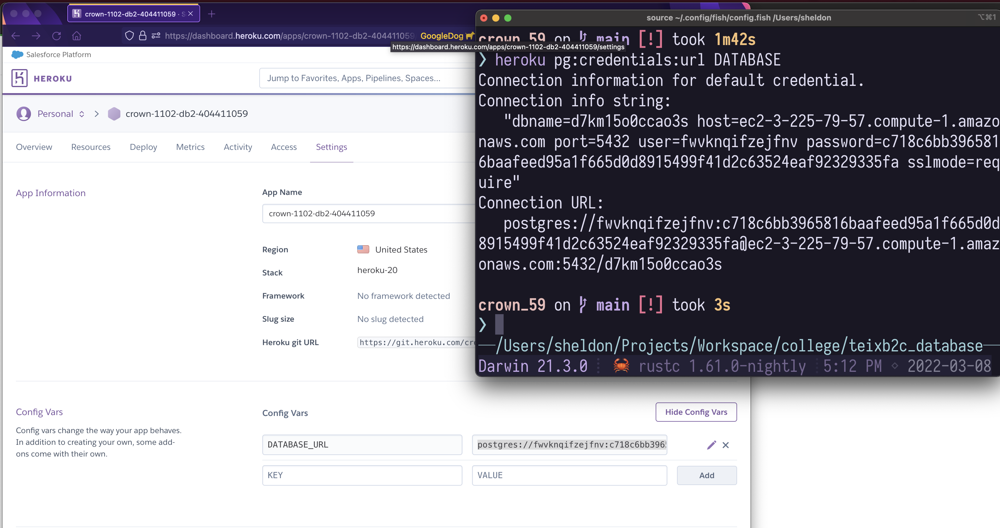

# W03 Homework
------
### W2: P1 for route /crown_xx


### W2: P2 push to Github using git clone


### W3: P3 push to Github using local repo



``` Heroku postgres URL
postgres://fwvknqifzejfnv:
c718c6bb3965816baafeed95a1f665d0d8915499f41d2c63524eaf92329335fa@
ec2-3-225-79-57.compute-1.amazonaws.com:
5432/
d7km15o0ccao3s
```
