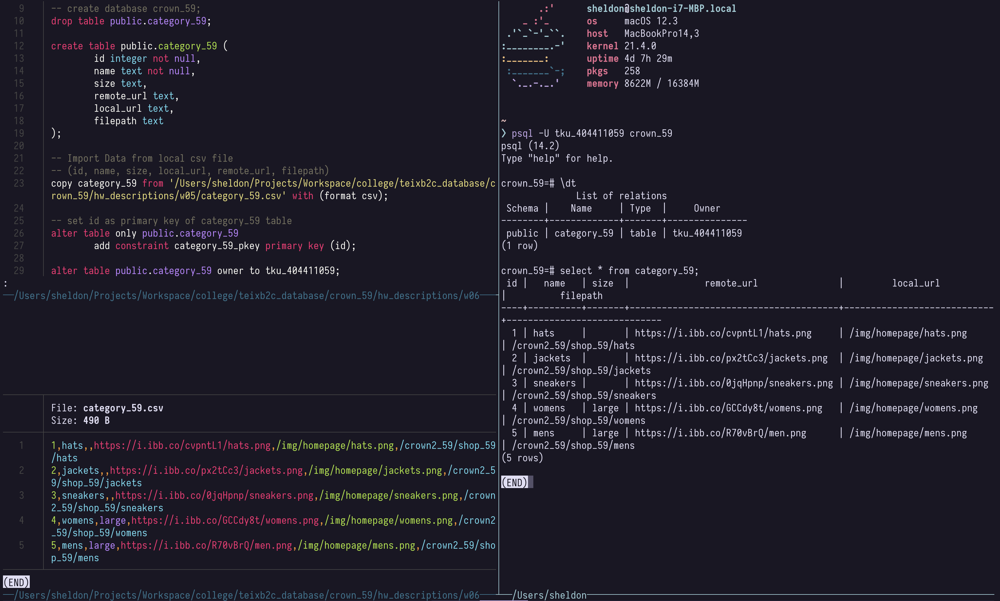
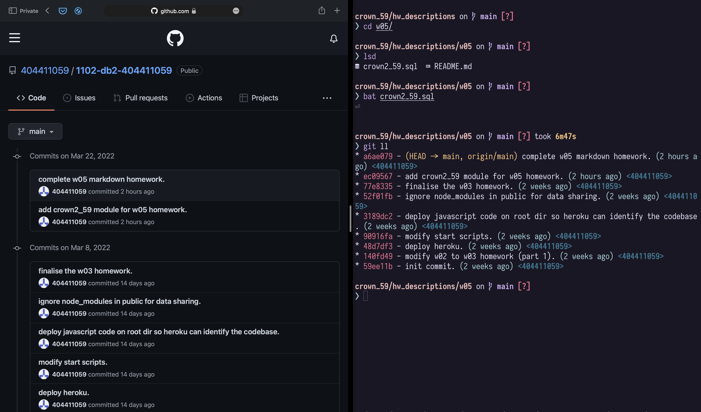

# W05 Homework
------
### P1 for route /crown2_59

### P2 push to Github using local repo

### P3 create database crown_59, table category_59 with 5 category data

### P4 Github commit messages

# W06 Homework
------
### P5 create a model `Category_59.js` under `models` directory, and fetch
### all data from table `category_59`

### P6 implement new Pg model into `crown2_59` router, get all data from
### local psql database instead of fixed file path in
### `views/crown2_59/index.ejs` file.

