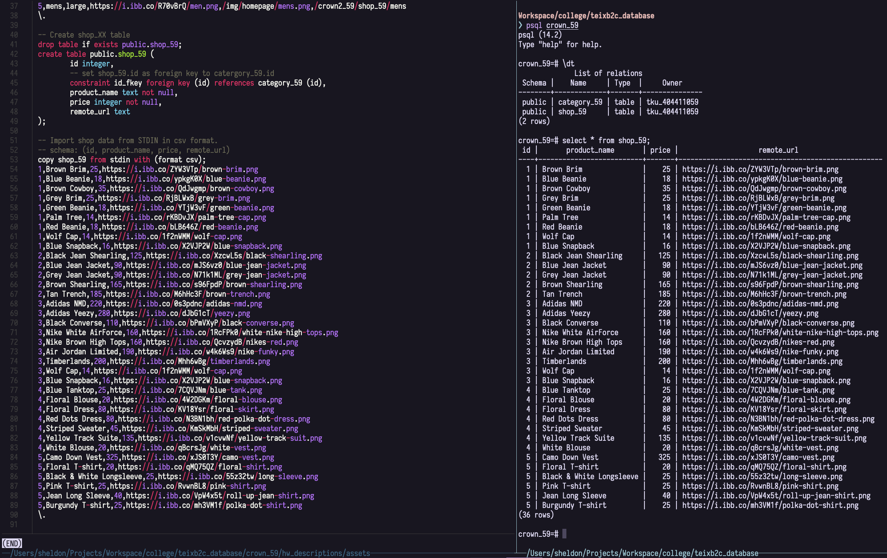

# W07 Homework
------
### P0 Github repo URL, and share with professor and TA

[GitHub Repo](https://github.com/404411059/1102-db2-404411059)

### P1 Local Psql database screenshot, select all data from `shop_59` table

### P2 add new ORM model `Shop_59.js`, and print JSON strings in console

### P3 add route module `shop_59.js`, show the code and running webpage

### P4 publish the SQL file on Heroku PSQL database instance, select all data from `shop_59` table and `DATABASE URL`

### P5 show the final result from Heroku, and the link to website.

[Heroku Project](https://crown-1102-db2-404411059.herokuapp.com/crown2_59/)

